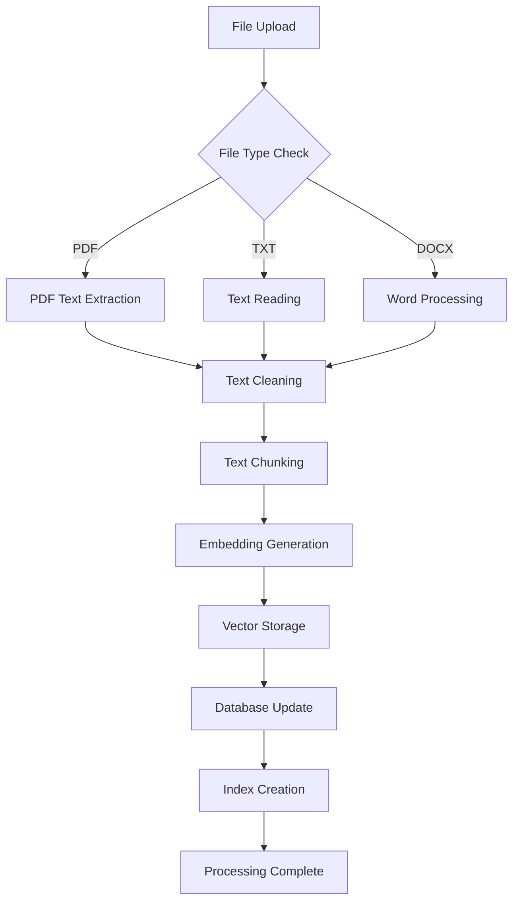
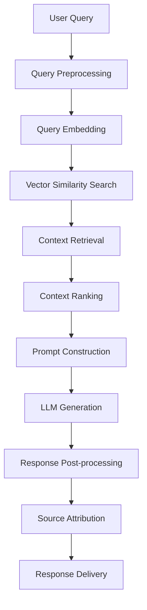
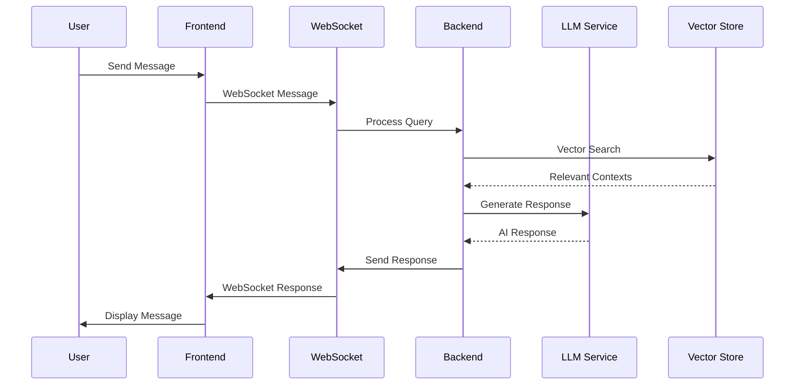

# 🏗️ Exercise 6 Architecture Guide

Comprehensive architectural overview of the RAG-Enhanced Chatbot system.

## 🎯 System Overview

The Exercise 6 RAG Chatbot is a modern, scalable system that demonstrates production-ready patterns for building intelligent chatbots with retrieval-augmented generation capabilities.

### Key Architectural Principles

1. **Microservices Architecture** - Loosely coupled services with clear boundaries
2. **Event-Driven Design** - Asynchronous processing for better performance
3. **Layered Architecture** - Clear separation of concerns
4. **API-First Design** - RESTful APIs with comprehensive documentation
5. **Container-Native** - Docker-first approach for consistency
6. **Observability** - Comprehensive logging and monitoring

## 🔧 Technology Stack

### Backend Stack
```
┌─────────────────────────────────────────┐
│                FastAPI                  │  ← Web Framework
├─────────────────────────────────────────┤
│              Pydantic                   │  ← Data Validation
├─────────────────────────────────────────┤
│             SQLAlchemy                  │  ← ORM Layer
├─────────────────────────────────────────┤
│         PostgreSQL + pgvector           │  ← Primary Database
├─────────────────────────────────────────┤
│              ChromaDB                   │  ← Vector Store
├─────────────────────────────────────────┤
│               Redis                     │  ← Caching Layer
├─────────────────────────────────────────┤
│         LangChain + LLMs                │  ← AI/ML Layer
└─────────────────────────────────────────┘
```

### Frontend Stack
```
┌─────────────────────────────────────────┐
│            React 18 + TypeScript        │  ← UI Framework
├─────────────────────────────────────────┤
│             Material-UI (MUI)           │  ← Component Library
├─────────────────────────────────────────┤
│              React Query                │  ← Data Fetching
├─────────────────────────────────────────┤
│             React Router                │  ← Client Routing
├─────────────────────────────────────────┤
│               Axios                     │  ← HTTP Client
└─────────────────────────────────────────┘
```

## 🏛️ System Architecture

### High-Level Architecture

```
┌─────────────────────────────────────────────────────────────────┐
│                        Client Layer                             │
├─────────────────────────────────────────────────────────────────┤
│  ┌─────────────────┐    ┌─────────────────┐                    │
│  │   Admin Console │    │ Chat Interface  │                    │
│  │   (React SPA)   │    │   (React SPA)   │                    │
│  │   Port: 3002    │    │   Port: 3003    │                    │
│  └─────────────────┘    └─────────────────┘                    │
└─────────────────────────────────────────────────────────────────┘
                               │
                               │ HTTP/WebSocket
                               ▼
┌─────────────────────────────────────────────────────────────────┐
│                      API Gateway Layer                         │
├─────────────────────────────────────────────────────────────────┤
│                     FastAPI Backend                            │
│                      Port: 8002                                │
│                                                                 │
│  ┌─────────────┐  ┌─────────────┐  ┌─────────────┐            │
│  │   API       │  │ WebSocket   │  │   Static    │            │
│  │ Endpoints   │  │   Handler   │  │   Files     │            │
│  └─────────────┘  └─────────────┘  └─────────────┘            │
└─────────────────────────────────────────────────────────────────┘
                               │
                               │ Internal APIs
                               ▼
┌─────────────────────────────────────────────────────────────────┐
│                    Business Logic Layer                        │
├─────────────────────────────────────────────────────────────────┤
│  ┌─────────────┐  ┌─────────────┐  ┌─────────────┐            │
│  │    RAG      │  │ Knowledge   │  │ Document    │            │
│  │  Pipeline   │  │ Base Mgmt   │  │ Processing  │            │
│  └─────────────┘  └─────────────┘  └─────────────┘            │
│                                                                 │
│  ┌─────────────┐  ┌─────────────┐  ┌─────────────┐            │
│  │    LLM      │  │   Vector    │  │    Cache    │            │
│  │  Service    │  │   Search    │  │  Manager    │            │
│  └─────────────┘  └─────────────┘  └─────────────┘            │
└─────────────────────────────────────────────────────────────────┘
                               │
                               │ Data Access
                               ▼
┌─────────────────────────────────────────────────────────────────┐
│                      Data Layer                                │
├─────────────────────────────────────────────────────────────────┤
│  ┌─────────────────┐  ┌─────────────────┐  ┌─────────────────┐ │
│  │   PostgreSQL    │  │    ChromaDB     │  │      Redis      │ │
│  │   + pgvector    │  │  (Vector Store) │  │    (Cache)      │ │
│  │   Port: 5433    │  │   Port: 8000    │  │   Port: 6380    │ │
│  └─────────────────┘  └─────────────────┘  └─────────────────┘ │
└─────────────────────────────────────────────────────────────────┘
```

## 📊 Data Architecture

### Database Design

#### PostgreSQL Schema
```sql
-- Core entities
knowledge_bases     ← Knowledge base collections
documents          ← Uploaded documents
document_chunks    ← Text chunks with embeddings
qa_pairs          ← Manual Q&A pairs

-- Chat system
chat_sessions     ← User conversation sessions
chat_messages     ← Individual messages

-- Analytics
message_feedback  ← User feedback on responses
search_analytics  ← Query performance metrics
```

#### Vector Storage Strategy
```
┌─────────────────────────────────────────┐
│            ChromaDB Collections         │
├─────────────────────────────────────────┤
│                                         │
│  rag_documents                          │
│  ├── Document chunks                    │
│  ├── Embeddings (384-dim)               │
│  ├── Metadata                          │
│  └── Source references                 │
│                                         │
│  qa_pairs                              │
│  ├── Question embeddings               │
│  ├── Answer content                    │
│  └── Confidence scores                 │
│                                         │
└─────────────────────────────────────────┘
```

### Data Flow

#### Document Ingestion Flow
```
Upload → Validation → Processing → Chunking → Embedding → Storage
   │         │           │          │          │          │
   │         │           │          │          │          ▼
   │         │           │          │          │    ┌─────────────┐
   │         │           │          │          │    │ PostgreSQL  │
   │         │           │          │          │    │ + ChromaDB  │
   │         │           │          │          │    └─────────────┘
   │         │           │          │          │
   │         │           │          │          ▼
   │         │           │          │    ┌─────────────┐
   │         │           │          │    │ Embedding   │
   │         │           │          │    │ Generation  │
   │         │           │          │    └─────────────┘
   │         │           │          │
   │         │           │          ▼
   │         │           │    ┌─────────────┐
   │         │           │    │   Text      │
   │         │           │    │  Chunking   │
   │         │           │    └─────────────┘
   │         │           │
   │         │           ▼
   │         │     ┌─────────────┐
   │         │     │ Document    │
   │         │     │ Processing  │
   │         │     └─────────────┘
   │         │
   │         ▼
   │   ┌─────────────┐
   │   │ File Type   │
   │   │ Validation  │
   │   └─────────────┘
   │
   ▼
┌─────────────┐
│ File Upload │
│ & Storage   │
└─────────────┘
```

#### RAG Query Flow
```
User Query → Embedding → Vector Search → Context Ranking → LLM Generation → Response
     │          │           │              │                │               │
     │          │           │              │                │               ▼
     │          │           │              │                │         ┌─────────────┐
     │          │           │              │                │         │  Response   │
     │          │           │              │                │         │ + Sources   │
     │          │           │              │                │         └─────────────┘
     │          │           │              │                │
     │          │           │              │                ▼
     │          │           │              │          ┌─────────────┐
     │          │           │              │          │ LLM Service │
     │          │           │              │          │ (OpenAI/    │
     │          │           │              │          │ Anthropic)  │
     │          │           │              │          └─────────────┘
     │          │           │              │
     │          │           │              ▼
     │          │           │        ┌─────────────┐
     │          │           │        │ Context     │
     │          │           │        │ Ranking &   │
     │          │           │        │ Selection   │
     │          │           │        └─────────────┘
     │          │           │
     │          │           ▼
     │          │     ┌─────────────┐
     │          │     │ ChromaDB    │
     │          │     │ Similarity  │
     │          │     │ Search      │
     │          │     └─────────────┘
     │          │
     │          ▼
     │    ┌─────────────┐
     │    │ Query       │
     │    │ Embedding   │
     │    │ Generation  │
     │    └─────────────┘
     │
     ▼
┌─────────────┐
│ User Query  │
│ Processing  │
└─────────────┘
```

## 🔧 Component Architecture

### Backend Components

#### 1. API Layer (`app/api/`)
```python
# RESTful endpoints organized by domain
knowledge_base.py  ← Knowledge base CRUD operations
documents.py       ← Document upload and management
qa_pairs.py       ← Q&A pair management
chat.py           ← Chat and WebSocket endpoints
```

#### 2. Service Layer (`app/services/`)
```python
# Business logic and external integrations
document_processor.py  ← PDF/text processing
vector_store.py       ← ChromaDB integration
rag_pipeline.py       ← RAG workflow orchestration
llm_service.py        ← LLM provider abstraction
```

#### 3. Data Layer (`app/models/` & `app/schemas/`)
```python
# Data models and validation
models/
├── knowledge_base.py  ← SQLAlchemy models
├── documents.py
└── qa_pairs.py

schemas/
├── knowledge_base.py  ← Pydantic schemas
├── documents.py
└── chat.py
```

#### 4. Utility Layer (`app/utils/`)
```python
# Shared utilities and helpers
file_handler.py   ← File operations
embeddings.py     ← Embedding generation
logging.py        ← Structured logging
```

### Frontend Components

#### Admin Console Architecture
```
src/
├── components/
│   ├── Dashboard/          ← Analytics and overview
│   ├── KnowledgeBase/      ← KB management
│   ├── Documents/          ← Document upload/management
│   ├── QAPairs/           ← Q&A pair editor
│   └── Common/            ← Shared components
├── pages/
│   ├── DashboardPage.tsx
│   ├── DocumentsPage.tsx
│   └── SettingsPage.tsx
├── services/
│   ├── api.ts             ← API client
│   ├── auth.ts            ← Authentication
│   └── websocket.ts       ← Real-time updates
└── hooks/
    ├── useDocuments.ts    ← Document management
    ├── useChat.ts         ← Chat functionality
    └── useAnalytics.ts    ← Analytics data
```

#### Chat Interface Architecture
```
src/
├── components/
│   ├── ChatInterface/     ← Main chat component
│   ├── MessageList/       ← Message display
│   ├── InputBox/          ← Message input
│   ├── SourcePanel/       ← Source references
│   └── TypingIndicator/   ← Real-time feedback
├── services/
│   ├── chatApi.ts         ← Chat API client
│   └── websocket.ts       ← WebSocket connection
└── hooks/
    ├── useChat.ts         ← Chat state management
    ├── useWebSocket.ts    ← WebSocket hooks
    └── useMessages.ts     ← Message handling
```

## 🔄 Process Flows

### Document Processing Pipeline



### RAG Query Processing



### Real-time Chat Flow



## 🔒 Security Architecture

### Authentication & Authorization
```
┌─────────────────────────────────────────┐
│            Security Layers              │
├─────────────────────────────────────────┤
│  ┌─────────────────────────────────────┐ │
│  │         API Gateway                 │ │
│  │  • CORS Configuration               │ │
│  │  • Rate Limiting                    │ │
│  │  • Request Validation               │ │
│  └─────────────────────────────────────┘ │
│                    │                     │
│  ┌─────────────────────────────────────┐ │
│  │      Authentication Layer           │ │
│  │  • JWT Token Validation             │ │
│  │  • Session Management               │ │
│  │  • User Context                     │ │
│  └─────────────────────────────────────┘ │
│                    │                     │
│  ┌─────────────────────────────────────┐ │
│  │      Authorization Layer            │ │
│  │  • Role-Based Access Control        │ │
│  │  • Resource Permissions             │ │
│  │  • Knowledge Base Access            │ │
│  └─────────────────────────────────────┘ │
│                    │                     │
│  ┌─────────────────────────────────────┐ │
│  │         Data Layer                  │ │
│  │  • Database Encryption              │ │
│  │  • Secure Connections               │ │
│  │  • Audit Logging                    │ │
│  └─────────────────────────────────────┘ │
└─────────────────────────────────────────┘
```

### Data Security
- **Encryption at Rest**: Database encryption for sensitive data
- **Encryption in Transit**: HTTPS/TLS for all communications
- **API Security**: JWT tokens, rate limiting, input validation
- **File Security**: Secure file upload with type validation
- **Audit Trail**: Comprehensive logging of all operations

## 📈 Scalability Considerations

### Horizontal Scaling Points

1. **API Layer**: Multiple FastAPI instances behind load balancer
2. **Database**: PostgreSQL read replicas for query scaling
3. **Vector Store**: ChromaDB clustering for large datasets
4. **Cache Layer**: Redis cluster for distributed caching
5. **File Storage**: Object storage (S3) for document files

### Performance Optimizations

1. **Database Indexing**: Optimized indexes for vector and text search
2. **Connection Pooling**: Efficient database connection management
3. **Caching Strategy**: Multi-layer caching (Redis, application, CDN)
4. **Async Processing**: Non-blocking I/O for better throughput
5. **Batch Processing**: Bulk operations for document processing

### Monitoring & Observability

```
┌─────────────────────────────────────────┐
│           Observability Stack           │
├─────────────────────────────────────────┤
│  ┌─────────────┐  ┌─────────────┐      │
│  │   Metrics   │  │    Logs     │      │
│  │ (Prometheus)│  │ (Structured)│      │
│  └─────────────┘  └─────────────┘      │
│         │                │              │
│         └────────┬───────┘              │
│                  │                      │
│  ┌─────────────────────────────────────┐ │
│  │           Grafana                   │ │
│  │  • Performance Dashboards          │ │
│  │  • Alert Management                │ │
│  │  • System Health Overview          │ │
│  └─────────────────────────────────────┘ │
└─────────────────────────────────────────┘
```

## 🔮 Future Enhancements

### Planned Features
1. **Multi-tenant Support**: Isolated knowledge bases per organization
2. **Advanced Analytics**: Query performance and usage analytics
3. **API Versioning**: Backward-compatible API evolution
4. **Workflow Engine**: Custom document processing pipelines
5. **Integration Hub**: Connectors for external data sources

### Technical Improvements
1. **Microservices Split**: Separate services for different domains
2. **Event Sourcing**: Event-driven architecture for better auditability
3. **CQRS Pattern**: Separate read/write models for optimization
4. **GraphQL API**: Flexible query interface for frontend
5. **Kubernetes Deployment**: Container orchestration for production

This architecture provides a solid foundation for building production-ready RAG systems while maintaining flexibility for future enhancements and scaling requirements.
